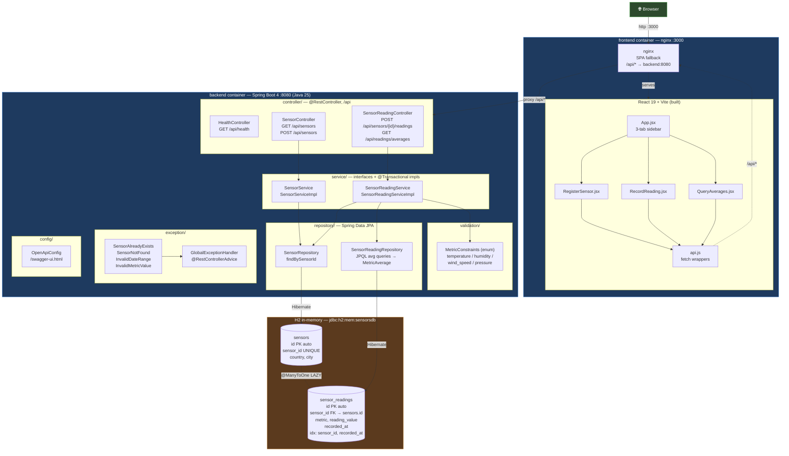

# Architecture

System diagram of the Weather Sensor API.



## Request flow

### Record a reading

```
Browser ──POST /api/sensors/{id}/readings──► SensorReadingController
       ──► SensorReadingService.recordReading
              ├─ SensorRepository.findBySensorId  → 404 if missing
              ├─ MetricConstraints.forMetric      → 400 if out of range
              └─ SensorReadingRepository.save     → 201 + body
```

### Query averages

```
Browser ──GET /api/readings/averages?metrics=…&sensorIds=…──►
   SensorReadingController
       ──► SensorReadingService.queryAverages
              ├─ resolveDateRange (default last 24h, max 31d)
              └─ Repository JPQL GROUP BY metric → MetricAverage rows
```
