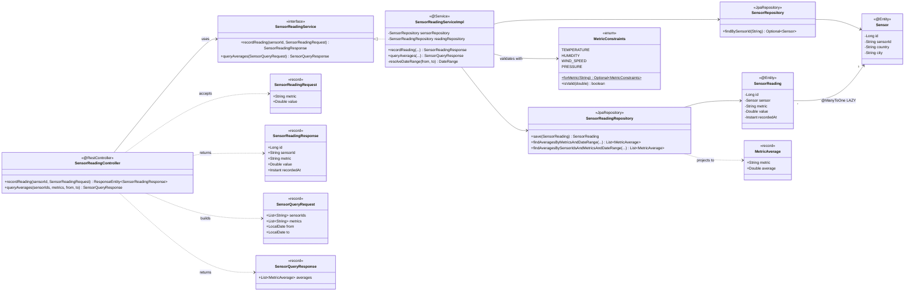

# Code Diagram (C4 — Level 4)

Class-level view of the sensor-reading slice — the most substantial flow in the codebase. Other slices (health check, plain sensor registration) are simpler and follow the same conventions.

C4 deliberately treats Level 4 as optional and easily out-of-date; consult the source for ground truth.

