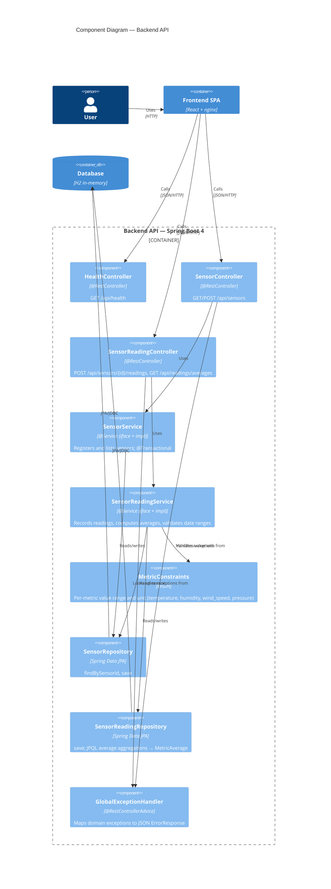

# Component Diagram (C4 — Level 3)

Zoom into the **Backend API** container. Shows the logical components (Spring stereotypes) and how a request flows through them.

The Frontend SPA container is intentionally not expanded here — its components (`RegisterSensor`, `RecordReading`, `QueryAverages`, `ResponseDisplay`, `api.js`) are simple and listed in [architecture.md](architecture.md).

