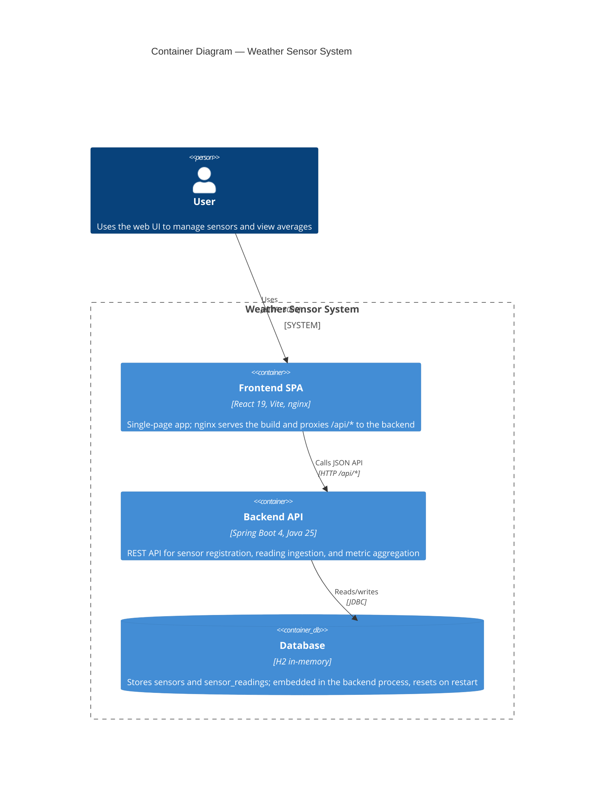

# Container Diagram (C4 — Level 2)

Technical building blocks of the Weather Sensor System and how they communicate. No internal code structure — that lives in [architecture.md](architecture.md).

```mermaid
C4Container
    title Container Diagram — Weather Sensor System

    Person(user, "User", "Uses the web UI to manage sensors and view averages")

    System_Boundary(system, "Weather Sensor System") {
        Container(frontend, "Frontend SPA", "React 19, Vite, nginx", "Single-page app; nginx serves the build and proxies /api/* to the backend")
        Container(backend, "Backend API", "Spring Boot 4, Java 25", "REST API for sensor registration, reading ingestion, and metric aggregation")
        ContainerDb(db, "Database", "H2 in-memory", "Stores sensors and sensor_readings; embedded in the backend process, resets on restart")
    }

    Rel(user, frontend, "Uses", "HTTP :3000")
    Rel(frontend, backend, "Calls JSON API", "HTTP /api/*")
    Rel(backend, db, "Reads/writes", "JDBC")
```
