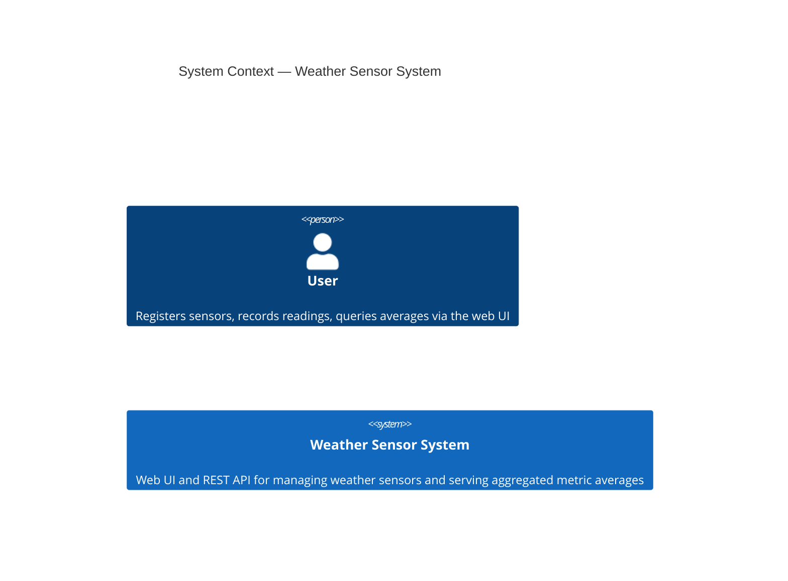

# System Context (C4 — Level 1)

High-level view of the Weather Sensor System and its users. The system is self-contained: embedded H2 database, no external services or third-party APIs.

```mermaid
C4Context
    title System Context — Weather Sensor System

    Person(user, "User", "Registers sensors, records readings, queries averages via the web UI")

    System(weatherSystem, "Weather Sensor System", "Web UI and REST API for managing weather sensors and serving aggregated metric averages")
```
